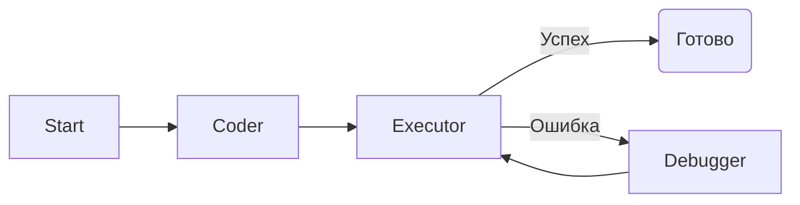

# AI Data Analyst (Agentic Code Interpreter)


Интерактивная мультиагентная система для анализа данных. Проект реализует паттерн **Code Interpreter**: пользователь загружает CSV-файл, задает вопрос на естественном языке, а агенты пишут, выполняют и отлаживают Python-код для генерации ответов и интерактивных графиков.

## Возможности

*   **Интерактивная визуализация:** Построение графиков через `Plotly` прямо в чате.
*   **Генерация и выполнение кода:** Система не галлюцинирует цифры, а пишет реальный Pandas-код, выполняет его в "песочнице" и возвращает точный результат.
*   **Self-Healing (Самовосстановление):** Если сгенерированный код содержит ошибку, агент **Debugger** анализирует Traceback и автоматически исправляет код без участия пользователя.
*   **Высокая производительность:** Использование Groq API обеспечивает генерацию кода за доли секунды.

## Архитектура

Система построена на графе состояний (StateGraph). Логика работы:



### Роли агентов:
1.  **Coder:** Анализирует структуру DataFrame (`df.info()`) и пишет Python-код для решения задачи.
2.  **Executor:** Безопасно выполняет код через `exec()`, перехватывает `stdout` и графические объекты.
3.  **Debugger:** Активируется только при возникновении исключения. Читает текст ошибки и переписывает код.

## Технологический стек

*   **Orchestration:** LangGraph (State management, cyclic graphs).
*   **LLM:** Llama-3.3-70b-versatile (через Groq API).
*   **Frontend:** Streamlit.
*   **Data Analysis:** Pandas, Plotly.
*   **Environment:** Python-dotenv.

## Установка и запуск

### 1. Клонирование репозитория
```bash
git clone https://github.com/egocucumber/ai_analyst.git
cd ai-data-analyst
```

### 2. Создание виртуального окружения
```bash
python -m venv .venv
# Windows
.venv\Scripts\activate
# Mac/Linux
source .venv/bin/activate
```

### 3. Установка зависимостей
```bash
pip install -r requirements.txt
```

### 4. Настройка API ключей
Создайте файл `.env` в корне проекта и добавьте ключ Groq (бесплатный):
```env
GROQ_API_KEY=gsk_...
```
*(Получить ключ можно здесь: [console.groq.com](https://console.groq.com/keys))*

### 5. Запуск приложения
```bash
streamlit run main.py
```

## Пример работы

**Сценарий:** Пользователь загружает файл продаж и просит: *"Построй график прибыли по месяцам"*.

1.  **Coder** пишет код, используя `pandas` и `plotly`.
2.  **Executor** запускает код.
3.  Если возникает ошибка (например, неверное имя колонки), **Debugger** исправляет её.
4.  В интерфейсе отображается интерактивный график.
